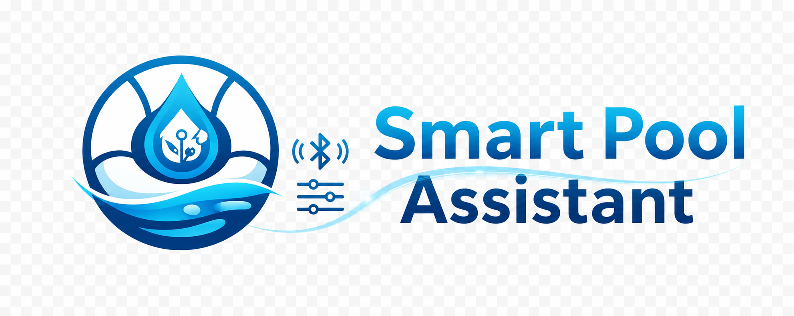
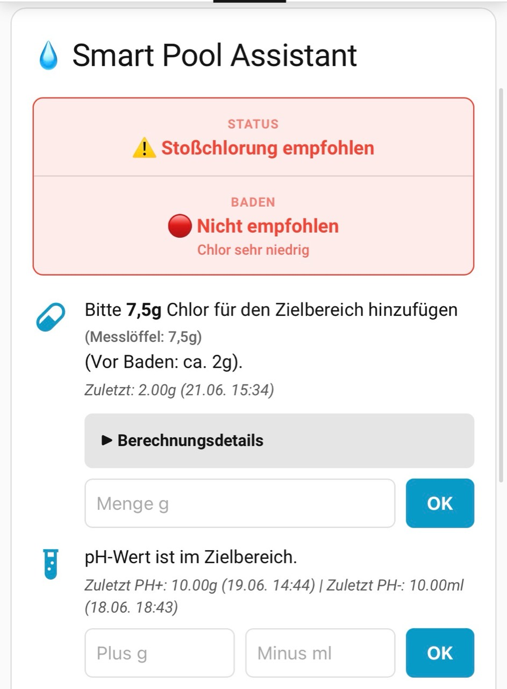

# Smart Pool Assistant

  

  
  
  
  
  

Der **Smart Pool Assistant** ist eine Home Assistant Integration fuer Pool- und Whirlpool-Pflege. Sie kombiniert PoolLab BLE, PoolLab Cloud, manuelle Sensoren, lernende Dosierlogik, Wartungshistorie und eine eigene Lovelace-Karte in einer zentralen Empfehlung.

**Aktueller Release-Stand: V3.0.8**

## Schnellueberblick

- volumenbezogene Chlor- und pH-Empfehlungen
- transparente Berechnungsdetails direkt in der Karte
- lernende Chlor- und pH-Analyse mit Prognosen
- manueller PoolLab-BLE-Abruf plus zyklischer Cloud-Sync
- CYA/Cyanursaeure aus PoolLab BLE und Cloud direkt in den aktuellen Messwerten
- PoolLab-Abruf oben in einer eigenen Box neben `Status` und `Baden`
- Nachmess-Workflow, Badeampel, Wetter- und LayZSpa-Integration

## Vorschau

  

## Dokumentation

- [Einrichtung und Konfiguration](docs/SETUP.md)
- [Chemielogik und Lernsystem](docs/CHEMISTRY.md)
- [Lovelace-Karte und Demos](docs/CARD_AND_DEMOS.md)
- [Entitaeten und bereitgestellte Sensoren](docs/ENTITIES.md)
- [FAQ und typische Diagnosefaelle](FAQ.md)
- [Technische Dokumentation](TECHNISCHE_DOKUMENTATION.md)
- [Changelog](Changelog.md)

## Navigation

| Thema | Seite |
| --- | --- |
| Setup und Konfiguration | [docs/SETUP.md](docs/SETUP.md) |
| Chemielogik und Lernsystem | [docs/CHEMISTRY.md](docs/CHEMISTRY.md) |
| Karte, Screenshots und Demos | [docs/CARD_AND_DEMOS.md](docs/CARD_AND_DEMOS.md) |
| Entitaeten | [docs/ENTITIES.md](docs/ENTITIES.md) |
| FAQ | [FAQ.md](FAQ.md) |
| Technische Referenz | [TECHNISCHE_DOKUMENTATION.md](TECHNISCHE_DOKUMENTATION.md) |

## Installation

### Ueber HACS

1. Oeffne **HACS** in Home Assistant.
2. Gehe auf **Benutzerdefinierte Repositories**.
3. Fuege dieses Repository als Typ `Integration` hinzu.
4. Installiere **Smart Pool Assistant**.
5. Starte Home Assistant neu.

### Manuell

1. Kopiere `custom_components/smart_pool_assistant` in deinen `custom_components` Ordner.
2. Starte Home Assistant neu.

## Was du als Naechstes lesen solltest

- Wenn du die Integration einrichten willst: [docs/SETUP.md](docs/SETUP.md)
- Wenn du die Chlor-Empfehlung fachlich verstehen willst: [docs/CHEMISTRY.md](docs/CHEMISTRY.md)
- Wenn du Screenshots, Kartenaufbau und LayZSpa sehen willst: [docs/CARD_AND_DEMOS.md](docs/CARD_AND_DEMOS.md)
- Wenn du tief in die Implementierung willst: [TECHNISCHE_DOKUMENTATION.md](TECHNISCHE_DOKUMENTATION.md)
