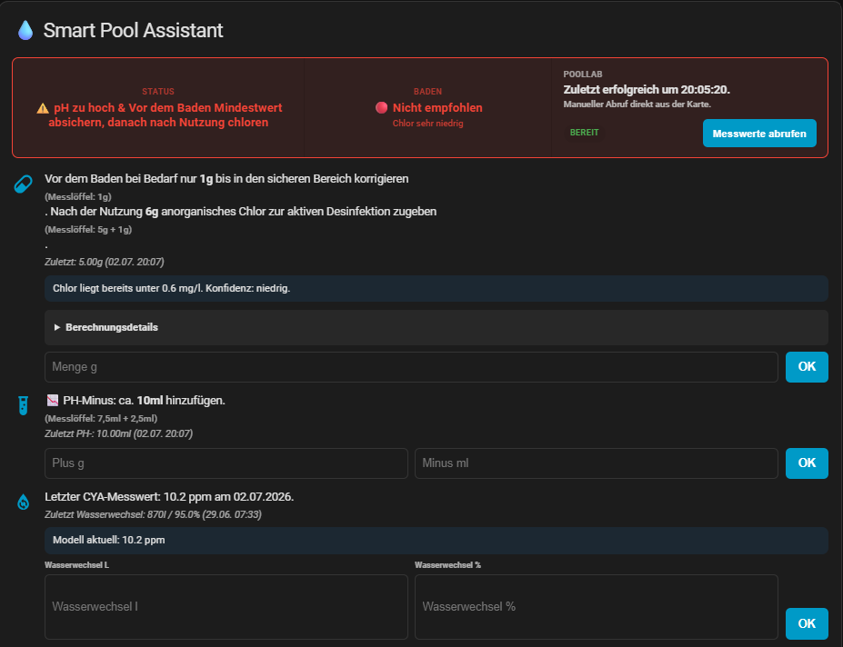
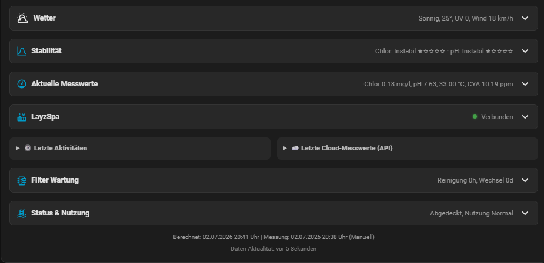
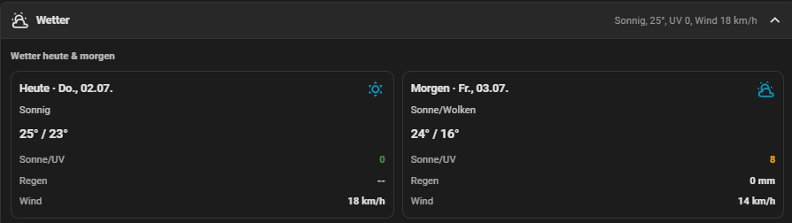
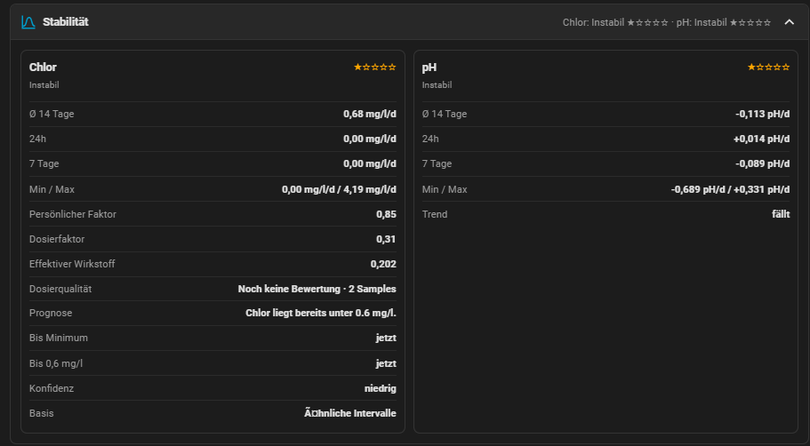
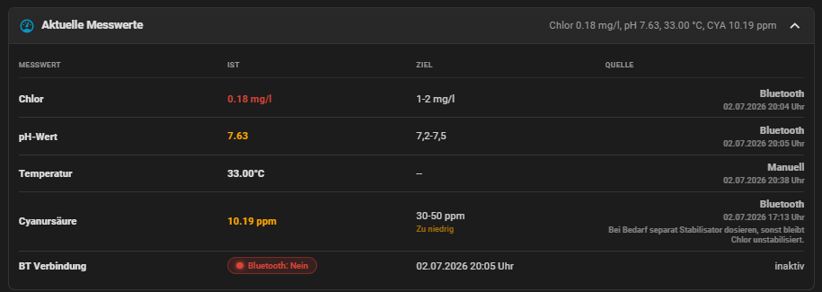
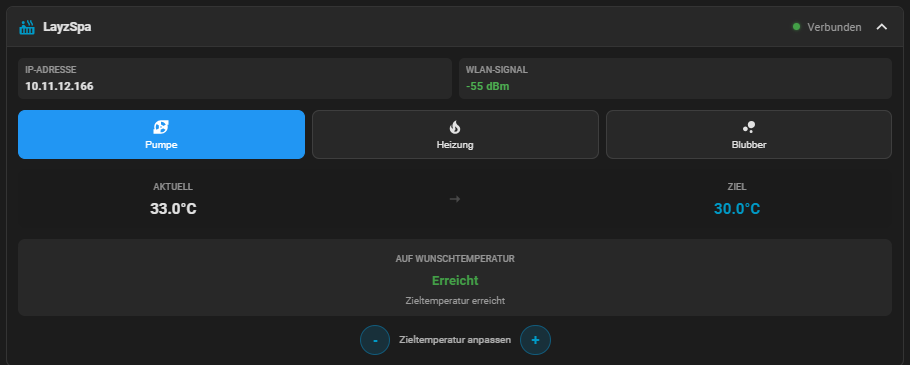
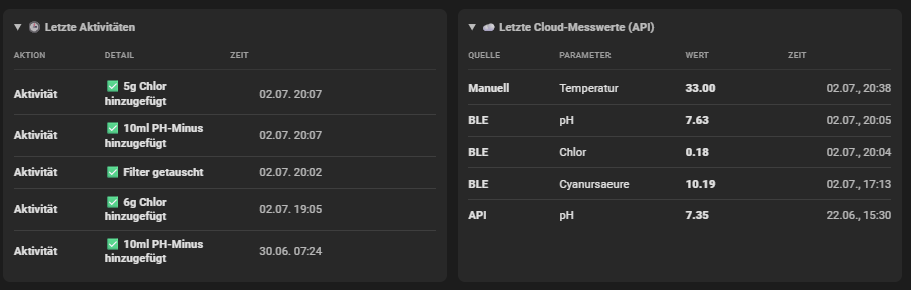
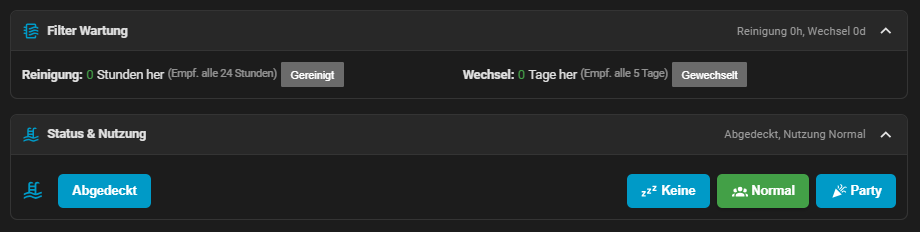

# Lovelace-Karte und Demos

Navigation:

- [Startseite](../README.md)
- [Setup](SETUP.md)
- [Chemielogik](CHEMISTRY.md)
- [Entitaeten](ENTITIES.md)
- [FAQ](../FAQ.md)
- [Technische Dokumentation](../TECHNISCHE_DOKUMENTATION.md)

## Demo-Galerie

Aktueller Screenshot-Stand der Karte vom 2026-07-02:

<p>
  <a href="../demo/overview-status.png"></a>
  <a href="../demo/sections-collapsed.png"></a>
  <a href="../demo/weather-expanded.png"></a>
  <a href="../demo/stability-expanded.png"></a>
</p>

<p>
  <a href="../demo/measurements-expanded.png"></a>
  <a href="../demo/layzspa-expanded.png"></a>
  <a href="../demo/activities-expanded.png"></a>
  <a href="../demo/maintenance-status.png"></a>
</p>

## Frontend: Pool Chemistry Card

Die Integration registriert automatisch eine Custom Card:

```yaml
type: custom:pool-chemistry-card
recommendation_entity: sensor.pool_empfehlung
grid_options:
  columns: full
  rows: auto
layzspa:
  enabled: true
  connection: binary_sensor.layzspa_connection
  ip: sensor.layzspa_ip
  rssi: sensor.layzspa_rssi
  pump: switch.layzspa_pump
  heater: switch.layzspa_heat_regulation
  airbubbles: switch.layzspa_airbubbles
  temp_current: sensor.layzspa_temp_c
  temp_target: sensor.layzspa_target_temp_c
  temp_target_control: number.layzspa_target_temp_c
  heat_eta:
    enabled: true
    history_hours: 48
    fallback_rate_c_per_hour: 3
```

`temp_target_control` ist optional und kann auf eine `number.*`- oder `climate.*`-Entitaet zeigen.

`heat_eta` ist optional. Die Karte laedt dafuer im Frontend die Home-Assistant-Historie von Ist-Temperatur und Heizung, berechnet daraus die reale Heizrate waehrend Heizphasen und zeigt die geschaetzte Restdauer bis zur Zieltemperatur.

## Was die Karte anzeigt

- Dosierempfehlung fuer Chlor und pH
- Badeampel mit `Baden empfohlen`, `Baden moeglich` oder `Nicht empfohlen`
- Berechnungsdetails inklusive Volumen, Dosierfaktor und effektivem Wirkstoff
- aktuelle Chlor-Prognose mit Konfidenz
- einklappbare Stabilitaetssektion fuer Chlor und pH
- Messwertetabelle mit `Messwert`, `Ist`, `Ziel` und `Quelle`
- eingeklappte Kopfzeilen mit Live-Zusammenfassungen je Bereich
- Wetter-Zusammenfassung und erweiterte Wetteransicht
- LayZSpa-Bereich inklusive optionaler Heizzeit-Prognose
- Letzte Aktivitaeten, letzte Cloud-Messwerte (API) und Filterwartungsstatus
- im Panel `Status & Nutzung` die Eingaben fuer Abdeckung, reduzierte Nutzungswahl und `Baden in`

## Hinweise zur Bedienung

- Der PoolLab-Abruf sitzt oben in einer eigenen Box neben **Status** und **Baden**.
- In **Aktuelle Messwerte** erscheint Cyanursaeure/CYA jetzt als eigener Messwert inklusive Quelle.
- Nach Chemiezugaben sperrt die Karte die Eingabe bis zur naechsten Messung.
- In den Berechnungsdetails siehst du, warum hohe Empfehlungen zustande kommen.
- In **Status & Nutzung** kannst du direkt `Baden in X Stunden` setzen. Damit richtet sich die Vor-Baden-Menge auf den geplanten Badezeitpunkt aus.
- Die Kartenbuttons fuer Nutzung sind bewusst auf `Keine` und `Party` reduziert. `Normal` bleibt intern und per Service moeglich, ist aber nicht mehr Teil des Standard-Workflows.
- Der visuelle Karten-Editor beschraenkt sich auf die LayZSpa-Optionen. Wetter und UV werden in der Integration konfiguriert.

## Weiterfuehrende Seiten

- [Einrichtung und Konfiguration](SETUP.md)
- [Chemielogik und Lernsystem](CHEMISTRY.md)
- [Entitaeten](ENTITIES.md)
